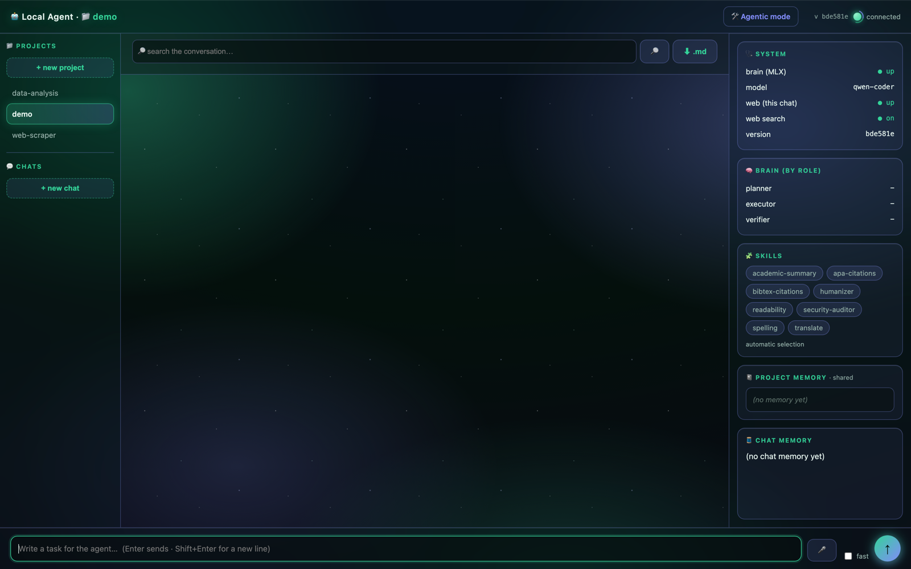
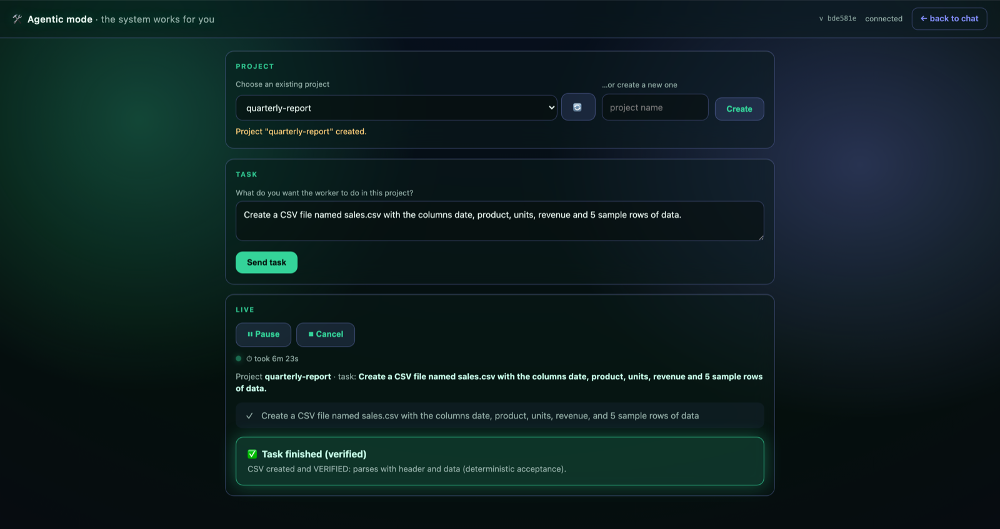

# Local Coding Agent on MLX

**A local-first coding agent running a 14B Qwen2.5-Coder (4-bit) on a Mac via MLX: OpenAI/Anthropic-compatible, 100% offline, and free.**

> **This repository is a curated showcase of the project's core: `src/`, `web/`, `skills/`, the invariant tests, and the screenshots in `docs/img/`.** The rest of the working project (benchmarks, launcher scripts, internal docs, and `requirements.txt`) lives in a separate private working repo; any passing references to those files describe that repo, not this one.

---

## What it is

A local-first coding agent that runs a **14B model, `mlx-community/Qwen2.5-Coder-14B-Instruct-4bit`** (4-bit, ~7.7 GB on disk), **directly on a Mac via MLX**. A single native `vllm-mlx` process serves the model and exposes **both the Anthropic Messages API** (`/v1/messages`, `/v1/messages/count_tokens`, with real `tool_use` / `tool_result` blocks) **and the OpenAI Chat Completions API** (`/v1/chat/completions`), bound to loopback (`http://127.0.0.1:8000`) by default.

Everything runs on your machine. The model, the agent, the tools, retrieval, and voice are **100% local and free**: nothing leaves the box. There is no cloud dependency in the default configuration (the executor is always local; the empty `AGENT_*` keys mean fully local out of the box).

Validated on a **MacBook Pro M4 Pro / 24 GB** (macOS arm64): ~8 GB resident, ~14-17 tok/s per turn (measured).

## Why it is different

This is not a wrapper around a hosted model. The design leans into the constraints of running a **14B** locally, and makes the harness, not the model, responsible for correctness.

- **Light context, always.** The agent never dumps whole files or whole histories into the model. Retrieval returns only top-k cited fragments; project conversation is compressed into an incremental summary plus the last N verbatim messages (bounded and constant in size); notebooks and search results are summarized and capped. The model sees small, relevant slices.
- **Deterministic over the model: the harness decides, the model narrates.** The verifier is anchored to the **real artifact on disk**: a deterministic workspace diff computes exactly which files a task created or modified, and the verifier is told to start from `list_dir` and use the real names, never guess from the prompt. Tri-state verdicts (`OK` / `FAIL` / `inconclusive`) are parsed by the harness, not trusted from prose. The self-audit script **fixes the verdict; the model only narrates it** and is explicitly told not to change it.
- **Honest about a 14B's limits.** Loop guards stop honestly instead of hallucinating: bounded iterations, mutation-signature anti-loop between iterations, in-generation repetition windows, and character/token backstops. When the model narrates a tool call as text instead of executing it, the harness either nudges it or reconstructs the real call, while explicitly **not** executing calls the model framed as examples. The known weaknesses of the 14B are documented below rather than hidden.
- **Audited security + self-audit.** File tools are confined under the project root with resolve-then-check anti-traversal (`_safe_path`); the shell has a regex destructive-command guard with cheap anti-obfuscation; web tools defend against SSRF and DNS-rebinding (validate-then-pin the resolved IP, re-validate every redirect); the web/WS layer enforces an Origin allowlist (anti-CSWSH) and per-endpoint size/time caps (anti-DoS). Three security audits were carried out, and a deterministic **self-audit** (`--autoauditoria`) re-checks the security invariants and runs external SAST on every run.

*A real run in agentic mode. During this task the 14B verifier failed twice (once with no clear verdict, once with a false `MISSING`); the deterministic check parsed the CSV on disk and issued the final verdict. This is the harness-over-model principle in practice.*

## Project structure

All application code lives in `src/` (21 Python modules); the web UI is two self-contained HTML files in `web/`.

### `src/`: the agent

| Module | What it does |
| --- | --- |
| `agent.py` | Agent engine: the tool definitions, the tool-calling loop, config loading, and the REPL. This is the executor; its heart is `run_agent()`. |
| `orchestrator.py` | Orchestration: plan → execute → verify, chat/task triage, the role-based model router, project memory, and the main CLI. |
| `worker.py` | Autonomous worker mode: a loop of agent passes verified by code, with deterministic acceptance checks (static web, CSV/notebook/DOCX/XLSX/PPTX, and Python module+test), staged execution with human approval, and honest stop conditions, never a false success. |
| `web_server.py` | Thin FastAPI backend behind the web UI: WebSocket chat, projects, chats, voice, uploads, vision, a system-health endpoint, and a lazily-built model router. |
| `web_tools.py` | The agent's web access (web search, read URL, arXiv) with SSRF / DNS-rebinding defenses and a prompt-injection guard that marks web content as untrusted data. |
| `knowledge.py` | Local RAG: indexes project documents and retrieves top-k fragments with source citations (lexical TF-IDF), with an optional hybrid mode. |
| `embeddings.py` | Optional embeddings layer for semantic / cross-language retrieval; off by default, degrades to TF-IDF if the model is absent. |
| `code_tools.py` | Deterministic Python code tools via `ast` / `ruff`: structure map, linter, symbol search, project structure, and diff. |
| `notebooks.py` | Deterministic `.ipynb` handling (read, create nbformat v4, byte-safe edit, `.ipynb` ↔ `.py` conversion) with no external notebook dependencies. |
| `deliverables.py` | Turns notes or a notebook into a polished document (`.docx` / `.pdf` / `.html`) via pandoc, with atomic, symlink-safe writes. |
| `skills.py` | Pluggable "skills" infrastructure: a light catalog, deterministic TF-IDF selection with a threshold, and on-demand instruction injection. |
| `conversations.py` | Search the project history and export it (accent-insensitive word search). |
| `projects.py` | Project storage: a folder per project, persisted history, an incremental summary (light context), and recoverable trash-delete. |
| `chats.py` | Multiple chats inside one project, with a safe, idempotent, zero-loss migration. |
| `time_machine.py` | Time machine: copy-based snapshots and an atomic, byte-exact undo. |
| `self_audit.py` | Deterministic security self-audit (SAST + hand-written invariants over `src/`): the script fixes the verdict, the model only narrates it. |
| `vision.py` | On-demand vision: a subprocess that loads a vision model, reads an image, and frees the RAM, with a memory guard and automatic model hand-off. |
| `voice.py` | 100% local voice: text-to-speech and speech-to-text, degrading honestly when a model is missing. |
| `brain.py` | Model-server lifecycle (alive / stop / start / wait-healthy), used by the vision RAM hand-off and the system-health panel. |
| `events.py` | A minimal observability hook: `emit(type, **data)`, a no-op when nobody listens, so the CLI stays untouched while the web UI uses it for live updates. |
| `evaluation.py` | A task battery that measures the agent's quality against the model. |

### `web/`: the interface

| File | What it does |
| --- | --- |
| `index.html` | The visual chat UI, self-contained (inline CSS/JS, no external CDN). |
| `agentic.html` | The worker / agentic-mode UI: submit a task, watch it run live, and approve stages. |

### `skills/`: pluggable skills

A skill is a folder with a `SKILL.md` header (`name`, `when_to_use`) plus an optional deterministic script. The catalog stays light: only `name` and `when_to_use` are kept in memory, and at most one skill is selected per turn by TF-IDF over `when_to_use`, above a threshold, so nothing fires by accident.

| Skill | What it does |
| --- | --- |
| `humanizer` | Flags AI writing tells (dashes, typographic quotes, AI vocabulary) so the model can rewrite them out. |
| `readability` | Readability metrics (Fernandez-Huerta, INFLESZ) as hard numbers; the script measures, the model interprets. |
| `spelling` | Mechanical spelling and grammar pass, with optional hunspell (degrades honestly if absent). |
| `apa-citations` | Checks APA 7th-edition citation formatting with linear, timeout-bounded regexes. |
| `bibtex-citations` | Validates BibTeX entries: required fields per entry type, brace-counting parser, no dependencies. |
| `academic-summary` | Faithful academic summarization (model-only, no script). |
| `translate` | Spanish and English translation in either direction (model-only, no script). |
| `security-auditor` | Runs the deterministic security self-audit and narrates the verdict without changing it. |

The writing skills analyse **Spanish-language** text. Their metadata and code are in English; the linguistic data they rely on (word lists, syllable rules, language-specific regexes) is Spanish by design, because that is what they measure.

## Tests

Running the invariant tests: `python -m unittest discover tests`

## Honest limits of the 14B

Documented on purpose: a 14B has real ceilings, and the harness is built around them.

- **Semantic inconsistency on open-ended tasks.** On vague, open-ended prompts the 14B can drift. The mitigation is the harness, not faith in the model: triage, plan critique, the artifact-anchored verifier, and honest stop conditions. **Ask for concrete, specific tasks** ("create `x.py` that does Y") rather than broad ones, you get far more reliable results.
- **Lexical RAG, no cross-language matching.** Retrieval is TF-IDF over tokens (`[a-z0-9]+`, length ≥ 2). It matches surface words, so a query in one language will not retrieve a document written in another, and it has no semantic synonym matching. It is honest about misses (returns `[]`) but it is lexical, not semantic.
- **STT depends on a local model.** `mlx-whisper` is pinned and installed by default, but if it fails to import/install on a given machine, speech-to-text says so instead of failing silently. TTS (`say`) is unaffected.
- **The shell guard is best-effort, not a jail.** `run_bash` is intentionally **not** sandboxed to the project root (unlike the file tools); it can reach whatever the user can. The destructive-command regex plus the printed command and optional `--confirmar-bash` are the protection, described in the code as best-effort, not a cage. With `--confirmar-bash` the regex guard is skipped in favor of explicit human approval.
- **Bounded everything.** Iterations (12), nudges (2), generation size, redirects (3), download bytes, upload sizes, and timeouts are all capped. The agent will stop honestly and tell you where it is rather than run away.
- **The pinned STRONG brain is opt-in and free-only.** Planner/verifier can use a cloud model, but only if it is configured **and** free; otherwise everything stays local. There is no paid path in the default config.

## License

MIT © arratedatascience. See [LICENSE](LICENSE).
